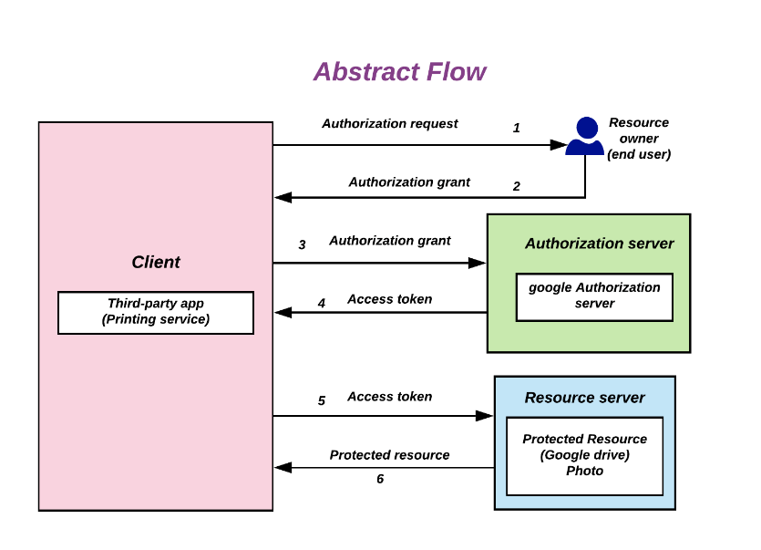

# Hello

## Cloud Computing


## Glorified Data Center


## Our Use Case - deliver CAD / CAM / MES software


## No admin rights? Try Cloud9


## Technologies for Our Use Case


## OAuth2




## Source Code

**Dive into Source Code**

## SAM Template -> CloudFormation Template

```yaml
AWSTemplateFormatVersion: '2010-09-09'
Transform: AWS::Serverless-2016-10-31
Resources:
  DownloadPortalFunction:
    Type: AWS::Serverless::Function
    DependsOn:
      - UserPool
      - UserPoolClient
    Properties:
      PackageType: Image
      Environment:
        Variables:
          USERPOOL_ID: !Ref UserPool
          CLIENT_ID: !Ref UserPoolClient
          CLIENT_SECRET: !Ref AppClientSecret
          LOGIN_DOMAIN: !Ref UserPoolDomain
          S3_BUCKET: !Ref S3DownloadBucket
      Events:
        HelloWorld:
          Type: Api
          Properties:
            Path: /download
            Method: get
```

## SAM Template - Lambda

```yaml
      Events:
        HelloWorld:
          Type: Api
          Properties:
            Path: /download
            Method: get
      Policies:
        - S3ReadPolicy:
            BucketName:
              !Ref S3DownloadBucket
    Metadata:
      Dockerfile: Dockerfile
      DockerContext: ./lambda_auth
      DockerTag: python3.9-v1
```

## Add your own resources, specific for your solution

```yaml
  UserPool:
    Type: AWS::Cognito::UserPool
    Properties:
      #UserPoolName: MyUserPool
      UsernameAttributes:
        - email
      Policies:
        PasswordPolicy:
          MinimumLength: 8
      Schema:
        - AttributeDataType: String
          Name: email
        - AttributeDataType: String
          Name: "Order_Number"
```

## Configure UserPool with OAuth

```
  UserPoolClient:
    Type: AWS::Cognito::UserPoolClient
    Properties:
      CallbackURLs:
        - !Sub "https://${PortalURLPrefix}.execute-api.${AWS::Region}.amazonaws.com/Prod/download"
      # - !Sub "https://${ServerlessRestApi}.execute-api.${AWS::Region}.amazonaws.com"
      AllowedOAuthFlowsUserPoolClient: True
      GenerateSecret: True
      AllowedOAuthScopes:
        - email
        - openid
        - profile
      SupportedIdentityProviders:
        - COGNITO
      AllowedOAuthFlows:
        - code
        #- implicit
      UserPoolId: !Ref UserPool
      ExplicitAuthFlows:
        - ALLOW_USER_PASSWORD_AUTH
        - ALLOW_REFRESH_TOKEN_AUTH
```

## Add Users

Add known users including additional attributes like order number

```
Outputs:
  AddCognitoUser:
    Description: "Call to create cognito default user"
    Value: !Sub "aws cognito-idp admin-create-user --user-pool-id ${UserPool}
       --username max.mustermann@infrastructure-as-code.de
       --user-attributes Name=email,Value=max.mustermann@infrastructure-as-code.de
      Name=custom:CO_Number,Value=CO-0099999"
```

## S3 Bucket

```
  S3DownloadBucket:
    Type: AWS::S3::Bucket
    Properties:
      AccessControl: Private

Outputs:
  AddS3BucketContent:
    Value: !Sub "aws s3 cp licence.key s3://${S3DownloadBucket}/CO-005176/"

```


## Questions

**Questions ???**


## Bildnachweis

* Cloud_computing - Sam Johnston, CC BY-SA 3.0, via Wikimedia Commons
* CAD/CAM - Tebis Technische Informationssysteme AG, CC BY-SA 3.0, via Wikimedia Commons
* AWS cloud9 - screenshot AWS product description page
* OAuth 2.0 flow - Devansvd, CC-BY-SA-4.0, via Wikimedia Commons

