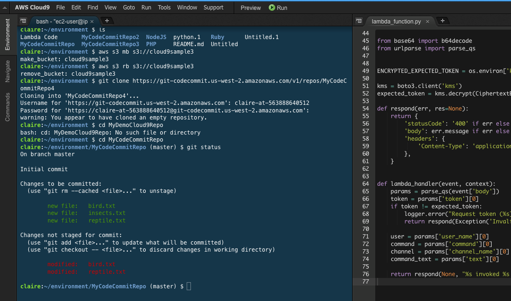

# Hello

## Cloud Computing

## Glorified Data Center

## Our Use Case - deliver CAD / CAM / MES software

## No admin rights? Try Cloud9

## Technologies for Our Use Case

## OAuth2

[OAuth2 flow](img/OAuth2-Abstract-flow.png)

## Bildnachweis

* Cloud_computing - Sam Johnston, CC BY-SA 3.0, via Wikimedia Commons
* CAD/CAM - Tebis Technische Informationssysteme AG, CC BY-SA 3.0, via Wikimedia Commons
* AWS cloud9 - screenshot AWS product description page
* OAuth 2.0 flow - Devansvd, CC-BY-SA-4.0, via Wikimedia Commons

## Questions

???

## Two columns of equal width

::: columns

:::: column

Left column text.

Another text line.

::::

:::: column

- Item 1.
- Item 2.
- Item 3.

::::

:::
